<p align="center">
  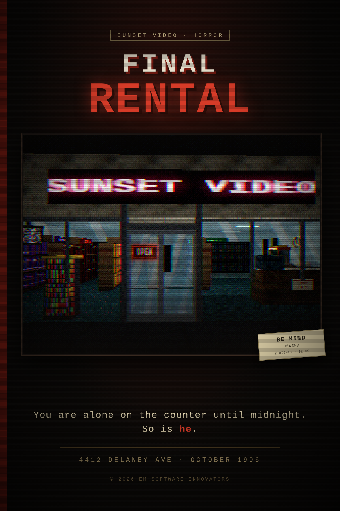
</p>

# FINAL RENTAL

A first-person horror game set on the graveyard shift at **Sunset Video**,
4412 Delaney Ave, October 1996.

You run the counter alone. Customers bring tapes back — some rewound, some not,
some days overdue. You take the late fees, you rewind what needs rewinding, and
you put every tape back on its own genre run. Other customers pull tapes off the
shelves themselves and expect to be rung up. They have opinions about your
carpet, your horror section, and how long you are taking.

Part-way through the shift a county deputy comes in and reads you a description
of a man who has been killing people who work counters after ten at night.

Some nights he comes in. He is polite. He pays cash. He asks what time you lock
up, and whether there is anyone in the back.

---

## Running it

```bash
npm start          # serves on http://localhost:8080
```

Then open <http://localhost:8080> and click to grab the mouse.

It **must** be served over `http://`. Opening `index.html` straight off disk
will show a blank screen, because browsers refuse to load ES modules from
`file://`.

**Browser:** anything from about 2018 on — Safari 12+, Chrome 63+, Firefox 60+.
The game needs ES modules and `<canvas>`, and nothing newer than that. Sound
starts on your first click.

---

## Shipping it

The game is a web page, and a web page in a downloaded folder is `file://`,
which browsers refuse to load ES modules from. So the desktop build does not
open a file &mdash; it serves itself over its own scheme, `game://app/`, out of
`electron/main.js`. No socket, no port to collide with, no firewall prompt on
first launch, and a real origin, which is what relative imports, `localStorage`
and pointer lock all need.

```bash
npm install
npm run app          # the desktop app, from the repo
npm run icon         # redraw build/icon.png (it is drawn, not sourced)
npm run dist         # installers and archives for this platform, into dist/
npm run dist:win     # or one at a time
npm run check:app    # launch it and check it actually came up
```

`npm run dist` produces a zip and an NSIS installer for Windows, zips for both
macOS architectures, and an AppImage and a tarball for Linux. The zips are the
ones worth uploading to itch: they unpack into a folder the itch client can run,
and nobody has to trust an installer.

Only `index.html`, `src/` and `electron/` go into the build &mdash; about 800K
before Electron's own 250MB. The tests, the tools, the screenshots and the dev
server are not in there, and are not reachable from the app if they were: the
protocol handler serves the page and `src/`, resolves every request before it
decides, and refuses everything else.

Cross-building is the usual Electron story: Windows and Linux artifacts build
anywhere, macOS ones want a Mac (and want signing and notarizing if they are to
open without a right-click on somebody else's machine).

`npm run check:app` needs a display. On a headless box:
`xvfb-run -a npm run check:app`.

---

## Controls

Keyboard and mouse, or a controller. A pad is detected the moment you touch it,
and every prompt in the game re-labels itself in that pad's language — Xbox face
buttons or PlayStation shapes. Everything is rebindable under **Options →
Controller**, and one button can carry more than one job, the way `E` does.

| | keyboard | pad |
|---|---|---|
| walk | `W A S D` or arrows | left stick, or the d-pad |
| hurry | `SHIFT` | either trigger |
| look | mouse | right stick |
| interact, talk, advance | `E` / left click | A / ✕ |
| choose a reply | `1`–`4`, or `↑ ↓` then `E` | `↑ ↓` then A / ✕ |
| notepad | `TAB` | Y / △ |
| put down what you are holding | `G` | X / ▢ |
| throw the bolt on the back room | `F` | RB / R1 |
| pause | `ESC` | Start / Options |
| back out of a menu | `ESC` | B / ○ |

In the desktop build, `F11` (or `ALT`+`ENTER`) toggles fullscreen. `ESC` is left
alone: it is the pause key, and native fullscreen does not eat it the way the
browser's own fullscreen would.

---

## The job

**Returns.** Take the tape — or the cartridge, if it came off the games wall.
Late fees run a dollar a day, two on a game, and the register wants them
collected. Not everyone agrees they are late. Some of them are lying, some of
them are right, and you cannot tell which from the screen.

**Rewinding.** A tape that comes back unwound has to go through the rewinder on
the counter before it goes back on a shelf. It keeps running while you serve
somebody else. Cartridges do not rewind, and saying they do gets you corrected.

**Shelving.** Seven runs: HORROR, COMEDY, ACTION, SCI-FI, DRAMA, FAMILY, and the
games wall. A tape on the wrong run counts against your shift. So does a tape
you shelved without rewinding, and so does anything still lying about at
closing.

**Rentals.** People pull their own tapes — and they take their time about it.
They drift to a section, read the backs of a few boxes, pull one out, turn it
over, put it back and try somewhere else. Tell them one is good and they will
take your word for it. Tell them you close soon and they will settle for
whatever is in their hand. Nobody is ever rung up in the middle of the floor:
business happens at the window, at the front of the line.

**The line is a line.** Whoever reaches it first is first, not whoever set off
first. Everyone has a fuse and the length of it depends on who they are — the
commuter who is double-parked is not the retiree who wants to tell you about her
sister's dog — and somebody who runs out of patience walks out.

**Money is paper.** Nothing goes straight into the register. They hand you a bill,
it sits in your hand until you walk it to the register and ring it up, and if
they gave you a twenty for a three dollar rental they are standing at your
counter until you count their change back out of the drawer. Cash still in your
hand at the end of the night is cash you have to explain. What is in the drawer
is not on the HUD either — walk over and count it, and it tells you what came in
tonight and what is out on accounts.

Some of them do not have any money at all, and what you do about that is up to
you — an account, a partial payment, a free rental out of your own numbers, or a
no. Turn a rental down and the tape goes in the returns bin, not back on the
shelf. Tapes do not put themselves away.

**Midnight is a lock on the door, not a bell.** Nobody else comes in; everybody
already inside still gets to pick something out and pay for it. The shift is
over when the last of them is out through the front door and every tape is back
in its run.

---

## The people

**Some of them are not all there.** A man wants the number three with no onions
and asks whether the shake machine is working. A woman has a load of whites in
the car and wants change for the machines. Someone is holding ticket B-forty-one
and would like to renew their license. You can explain, or you can play along
and see how far it goes — playing along makes them love you, and people who love
you buy things.

Others are in the right store with the wrong idea entirely: the tape that has to
work in a Betamax, the one returned to the wrong chain, the customer who believes
renting is just buying very slowly, and the man who has brought his entire VCR in
on a cart because yours does not make the noise.

**And then there are the regulars nobody wants.** Seventeen of them, each a
fixed face with a fixed problem, who turn up instead of an ordinary customer.
They are not transactions. They are situations, and most of them cost you real
minutes:

- The man who brings his own music, sets a boombox down on your floor and turns
  it up. He has to walk back to it, switch it off and carry it out.
- The smell, and the man at the television, who cannot be told and have to be
  worn down over a lot of conversations.
- A sovereign citizen with a folder, reading you statutes that do not exist, for
  as long as you let him.
- A man contacted in his sleep by people who do not use telephones, who needs to
  get into a basement this store has never had. Refusing does not work. An
  address for the *other* Sunset, across town, does.
- A woman who is not offended by the thing — she is offended that anybody else
  was — and who talks herself around to her sister's gravy and then rents a movie.
- A woman who wants your manager. Talking is a wall. The regional manager is
  forty minutes away and asleep, and the phone cord only reaches the counter.
- A man who calls first and orders a pizza, then turns up to collect it. The only
  thing that ends it is a real pizza, on your counter, with his toppings on it.
- A man who gets behind your counter and empties the popcorn tub into the
  kettle, and then it is on your floor and the vacuum is in the back room.

**The coach.** Once in a while a bus comes off the highway and three or four
dozen people get out of it, and every one of them looks exactly the same,
because they are all going to the same thing and have all dressed for it. They
come through the door together and they all want a movie. About one in four wants
to tell you about the journey first. He does not work a night the coach comes.

---

## The other thing

The deputy's description is the only thing you get, and it grows. The county
takes somebody off the street most nights and each one talks, so the picture
gets fuller — three things to check on the first night with a bulletin, ten by
the end of a long run.

That is harder, not easier. A short list is quick to clear somebody against. A
long one means every ordinary customer matches four or five of it, and the
question stops being *does he match* and becomes *does he match all of it* —
which takes time you do not have with three people in line.

- **Look at people.** Standing in front of someone takes in the obvious things —
  sex, height, build, hair, coat, whatever is on their face and in their hands.
  Getting close tells you what they smell like. Talking tells you what they
  sound like. Everything the deputy can describe is on the model: a ponytail is a
  ponytail, a limp is a limp, and the duffel bag is really there.
- **`TAB` compares.** The bulletin on the left, the person in front of you on the
  right, matches highlighted. Someone can match four of six lines and be nobody.
- **He may come in first as a customer**, browse, and check out a tape. He is the
  calmest person who will talk to you all night. He will ask you questions. How
  you answer them changes how long you have later.
- **If you are sure:** lock the front door, then pick up the phone. Dispatch
  reads back everyone in the store, each described so no two of them read alike.
  The deadbolt only buys minutes. Locking it is not the win; the phone is.
- **If you are wrong:** they put a regular customer face down on the carpet in
  front of six people, and the district manager drives in at two in the morning
  to take your keys.

When you call it in on the right person, a unit comes. What happens then depends
on him: a deputy walks in and puts him against the nearest flat surface, or he
hears the sirens and goes out the door before they arrive — and a deputy comes in
afterwards to tell you the street was empty and that whoever you described
matched their sheet to the letter. Or he decides there is no longer any reason
to be careful.

Ways a night ends: he never shows and you clock out into a harder shift
tomorrow; he gets in and reaches you; you call it in on the wrong person; or you
call it in on the right one.

There is also **CASUAL SHIFT**, which is just the store. Nobody is coming for
you.

---

## Pictures

| | |
|---|---|
| 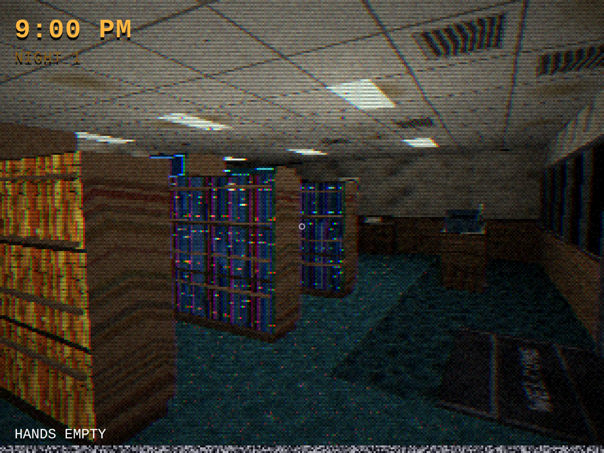 | 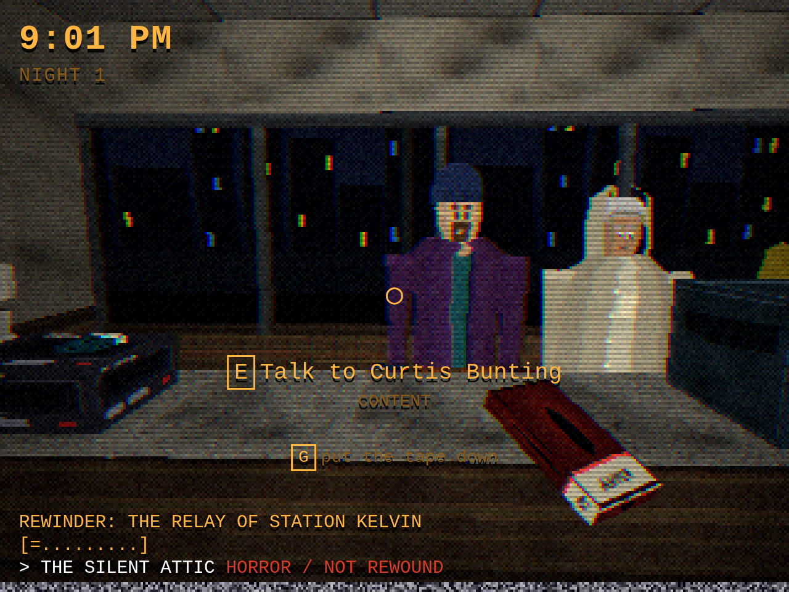 |
| *Sunset Video, from just inside the door* | *A tape in your hand, one in the rewinder, three people waiting* |
| 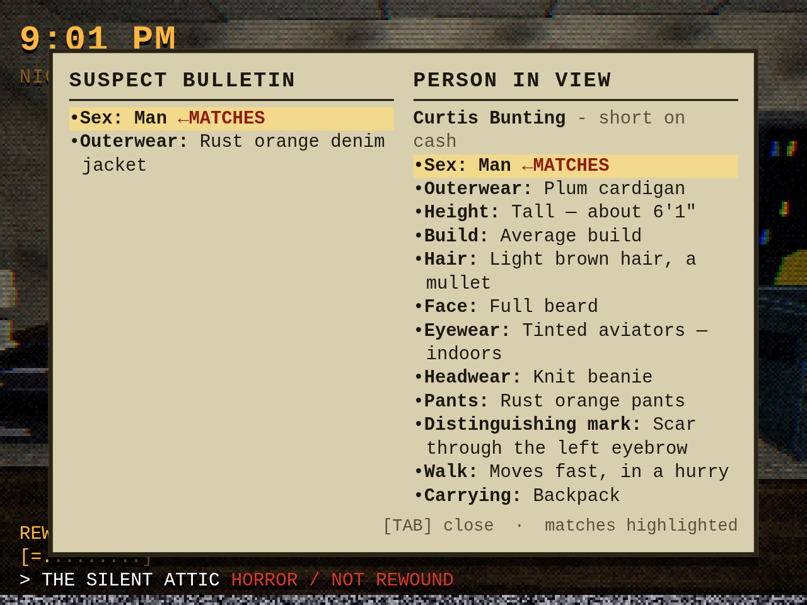 | 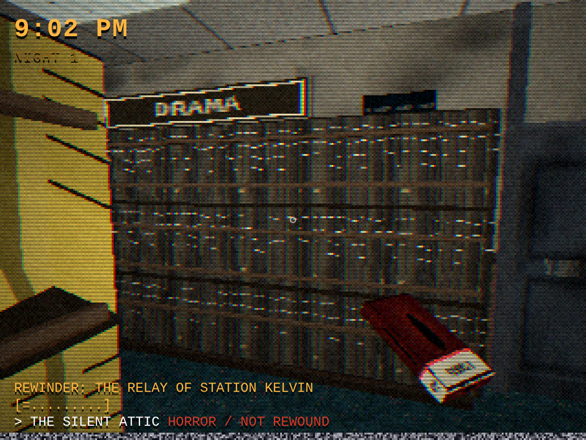 |
| *The bulletin, held against whoever is in front of you* | *Seven runs, and people who take their time over them* |
| 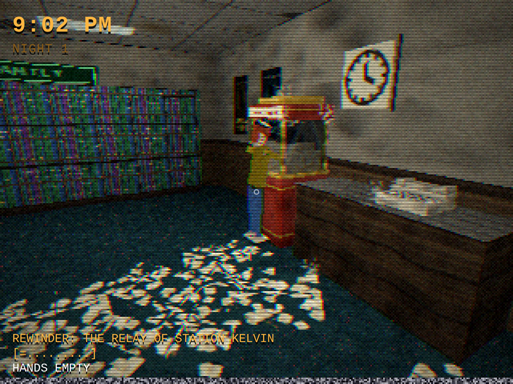 | 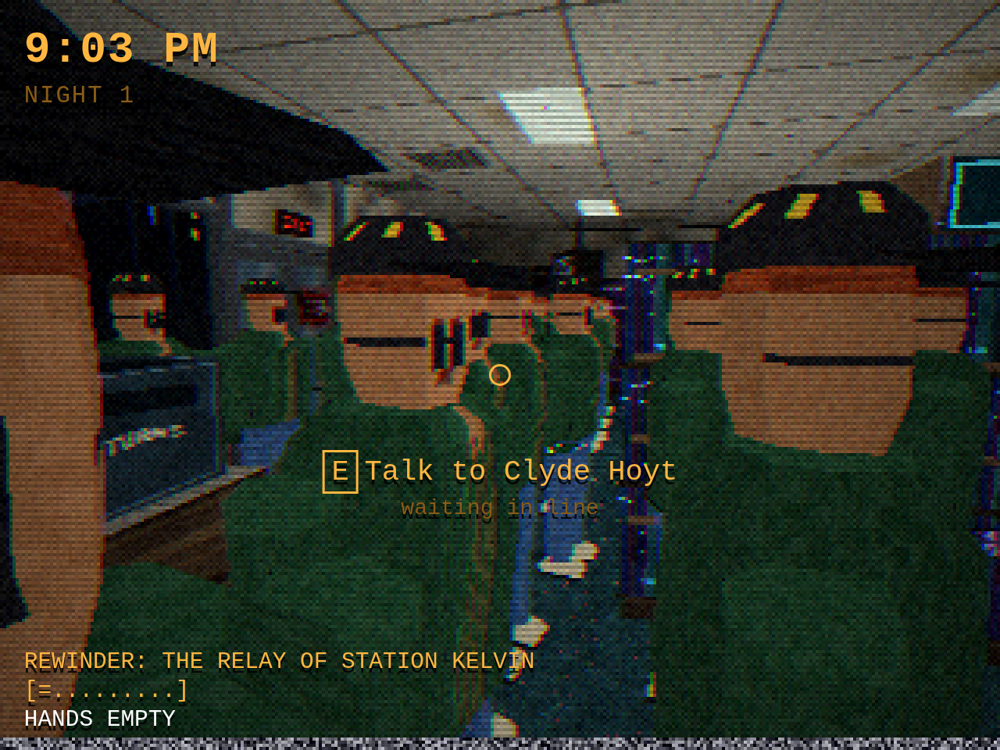 |
| *He tips the whole tub in. The whole tub.* | *Four dozen people who all look the same* |
| 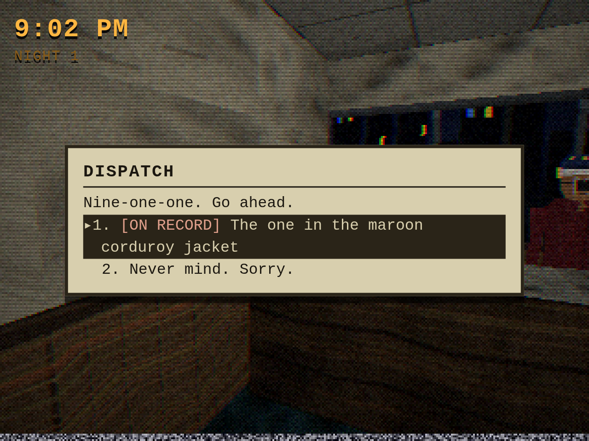 | 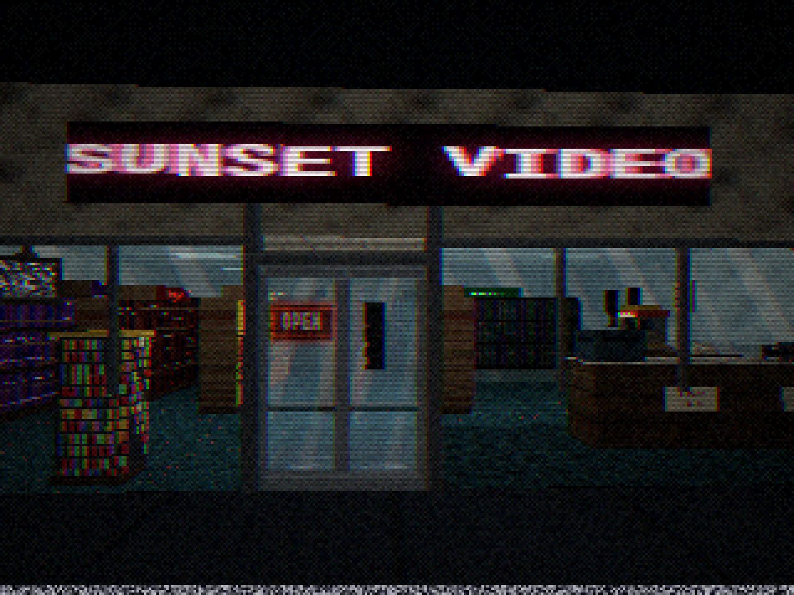 |
| *Dispatch. Once you roll a unit, it is on the record.* | *4412 Delaney Ave* |

Those are all taken through the tape, which is how the game ships. The same
nine are in [`docs/shots/clean`](docs/shots/clean) with the VHS emulation
switched off — no quantization, no dither, no chroma bleed, no scanlines —
which is what the renderer itself puts out, and what the OPTIONS screen gives
you if you turn the tape off.

| | |
|---|---|
| 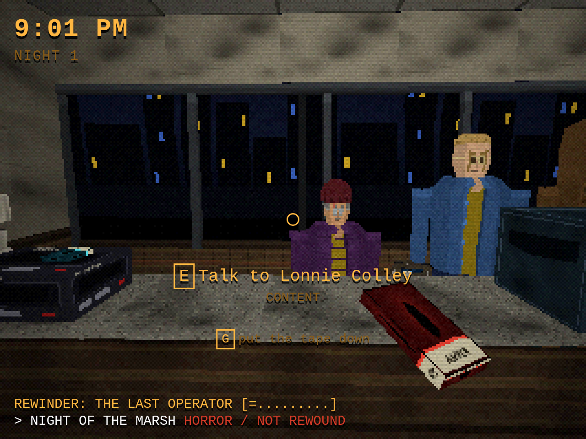 | 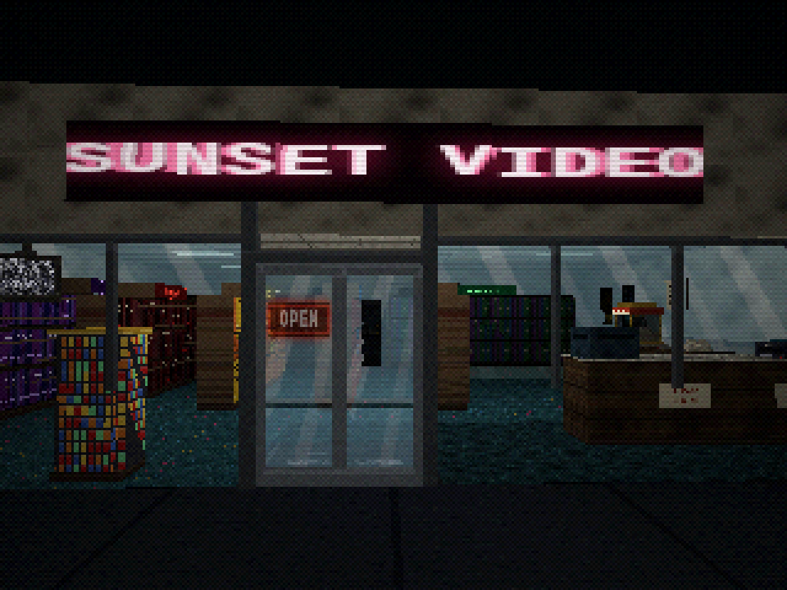 |
| *The same frame with the tape switched off* | *And the same again* |

Both sets come out of `tools/shots.mjs`, which sets each scene up through the
simulation, lets it settle, and photographs it at the renderer's highest
internal resolution. Nothing is composited and nothing is posed by hand that
the game would not pose itself.

---

## What it is made of

No engine, no libraries, no asset files. Every polygon, texture, animation and
sound is generated at runtime by about 17,000 lines of JavaScript.

### The renderer

`src/engine/raster.js` is a software triangle rasterizer written to reproduce
the hardware of a classic PlayStation rather than imitate it with a filter:

- **Integer vertex snapping.** Projected vertices are rounded to whole pixels,
  exactly like the PlayStation's GTE, which had no subpixel precision. This is
  the source of the polygon wobble on anything that moves.
- **Lofted, faceted bodies.** People are not boxes. Every part is a stack of
  cross-sections skinned into a tapered solid — a torso that narrows at the
  waist and slopes at the shoulders, an eight-sided skull with one flat panel
  for the face, limbs that thin toward the wrist. Build and sex are baked into
  separate meshes rather than squashed in with a scale factor, so "heavy set"
  and "thin, narrow shoulders" read from across the store, which they have to.
- **Affine texture mapping.** UVs are interpolated linearly in screen space with
  no perspective correction, so textures swim across large surfaces. The period
  fix was to subdivide big polygons, so the floor, ceiling, walls, counter faces
  and doors are built as grids of roughly one-meter tiles — which is why they
  are.
- **Per-vertex shading with black fog** folded into a single interpolated scalar,
  so the whole shading step is two multiplies per pixel. There are no lightmaps
  and no per-pixel lights; the store's nine fluorescents are baked into vertex
  colors at build time.
- **Nearest-neighbor texels**, a 1/z depth buffer, near-plane clipping, and
  blend modes for the glass.

`src/engine/postfx.js` is the tape deck on top: 15-bit color quantization with a
4×4 Bayer dither (the PlayStation dithered in hardware; that is where the
crosshatch in the gradients comes from), composite chroma bleed, phosphor
ghosting, scanlines, a rolling head-switching band, dropout flecks, and the
garbage line at the bottom of the frame that a real VHS never quite hides.

Everything renders into a 320×240 buffer and is scaled up with nearest-neighbor.

### Sound

`src/engine/audio.js` is Web Audio and nothing else — no samples. The chime over
the door, the ratchet of the rewinder, the register, the bell inside the telephone,
kernels going off one at a time in the popcorn kettle, the vacuum, and the music
out of the boombox are all synthesized as the game runs.

### Tests

Sixteen headless harnesses drive the real game in a real browser — the menus, a
controller, the closing procedure, the arrest, each of the awkward regulars, a
full playthrough — and assert on what actually happens rather than on what the
code says.

```bash
node tools/check.mjs
```

---

<p align="center">
  <sub>&copy; 2026 EM Software Innovators</sub>
</p>
